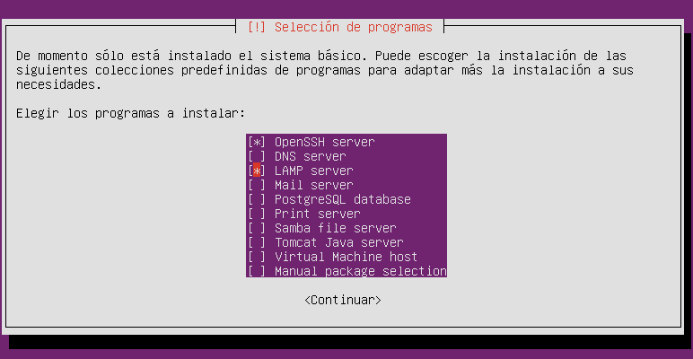
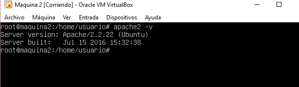
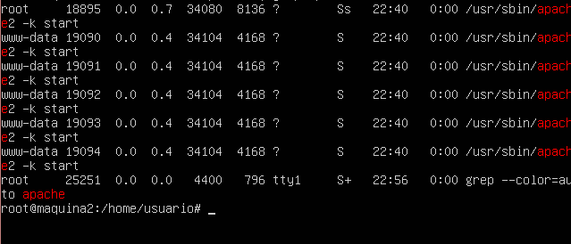

#Practica 1: Presentación de las prácticas y preparación de las herramientas

En esta practica el objetivo es configurar dos máquinas virtuales con Ubuntu server, junto con los paquetes necesarios para montar un servidor LAMP y un servidor ssh.

Para ello realizamos una instalación basica de Ubuntu Server y marcamos los siguientes paquetes a isntalar en durante la isntalación

Comprobamos que tenemos el servidor apache instalado

Y que se esta ejecutando

Podemos comprobar que que apache funciona creando un archivo html, guardandolo en la carpeta /var/www y usando la orden curl

