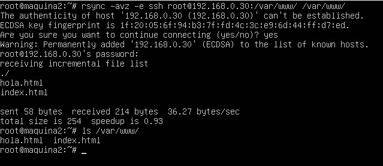

#Practica 2: Clonar la información de un sitio web

En esta practica el objetivo es copiar archivos con ssh, para clonar contenido entre dos máquinas. Para esto, se configurara ssh para acceder a máquinas remotas sin contraseña, y por último, se automatizara la tarea usando cron.

##Copia de archivos por ssh

En primer lugar, vamos a probar a mandar un archivo.tar de una máquina a otra con la orden ssh. Para ello creamos un archivo de texto en la máquina 1, lo comprimimos y lo enviamos mediante ssh

 

  "Archivo recibido"

## Copia de carpetas con rsync

En este apartado vamos a usar la herramienta rsync para copiar dos carpetas. En este caso la carpeta con el contenido del servidor web principal (máquina 1) en la máquina 2. Para ello primero creamos uno o dos archivos html en dicha carpeta.

 

Para copiar la carpeta, ejecutamos rsync en la máquina 2, y tras pedirnos la contraseña del usuario, los archivos se copiarán

 

Y si ejecutamos la orden ls sobre el directorio /var/www de la máquina 2 podemos ver que los archivos ya están copiados

##Acesso ssh sin contraseña

Para poder automatizar la tarea de enviiar archivos desde una máquina a otra, necesitamos que ssh no requiera que una persona escriba una contraseña cada vez que se quiera enviar un archivo.

Para ello, primero debemos ejecutar el siguiente comando en la máquina 2 el comando

ssh-keygen -t dsa

 

Y para copiar la llave en la máquina 1  ejecutamos el comando en la máquina 2:

ssh-copy-id -i root/.ssh/id_dsa.pub root@maquina1

 

Comprobamos que no requiere contraseña

 

##Programación de tareas con crontab

Por último, vamos a editar el archivo /etc/crontab , para que el administrador de procesos cada hora ejecute una tarea que mantenga actualizados los dos servidores. Añadimos una linea para que la orden rsync se ejecute cada hora, todos los dias

 

