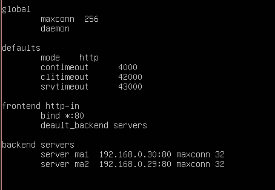

#Práctica 3: Balanceo de carga

El objetivo de esta practica práctica, es configurar una red entre varias máquinas de forma que tengamos un balanceador que reparta la carga entre varios servidores finales.

#Balanceo con nginx

Una vez tenemos instalados nginx, debemos modificar su configuración, ya que la que trae por defecto se corresponde a la funcionalidad de un servidor web.

Para ello modificamos el fichero /etc/nginx/conf.d/default.conf dejandolo de la siguiente manera:

 

Y despues reiniciamos el servicio nginx con el comando

service nginx restart

Y comprobamos con la orden curl el balanceo con nginx (round-robin en este caso)

 

Para que el balanceo de carga sea ponderado, deberemos añadir el modificador "weight" para modificar la carga de tráfico que recibe cada servidor

 

En este caso la máquina 1 tiene el doble de capacidad que la máquina 2. Lo probamos con el comando curl

 

#Balanceo con haproxy

Una vez instalado haproxy con apt-get, modificamos el fichero de configuración (/etc/haproxy/haproxy.conf) de la siguiente manera.

 

Lanzamos el servicio haproxy con el comando

/usr/sbin/haproxy -f /etc/haproxy/haproxy.cfg

Y hacemos las peticiones a la máquina

 

Y para darle mas peso a la máquina 1 modificamos el archivo de configuración:

 

Y comprobamos que funciona

 

