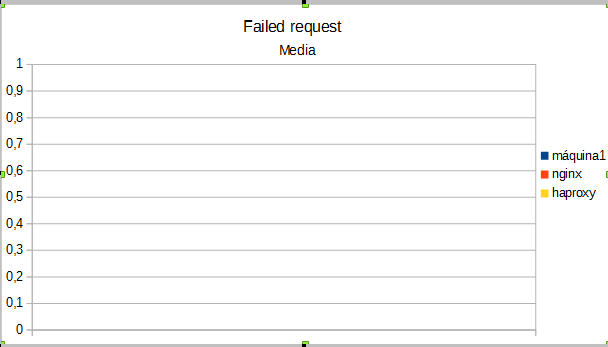

#Práctica 4: Comprobar el rendimiento de servidores web

Para esta práctica, el objetivo es medir el rendimiento de los distintos servidores que hemos montado en las prácticas anteriores. Para ello vamos a utilizar las herramientas Apache Benchmark y Siege, midiendo el rendimiento de una sola máquina servidora (en este caso la máquina 1), y el rendimieno de las dos granjas webs  (una con nginx y la otra con haproxy).

Para las mediciones, tomaremos 10 de cada una y calcularemos la media y la desviación.

##Rendimiento con Apache Benchmark

Para calcular el rendimiento con Apache Benchmark he utilizado el comando

ab -n 100 -c 1 http://ip-maquina/prueba.html

###Media

 

 

 

##Desviacion

 

 

