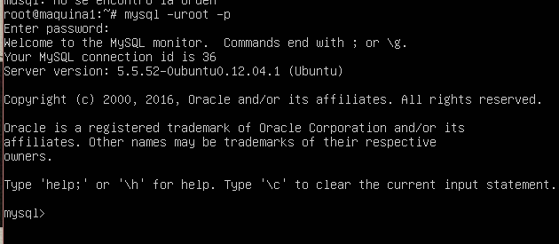
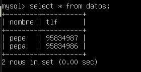
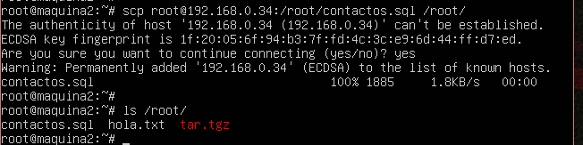
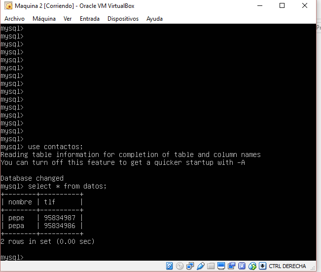
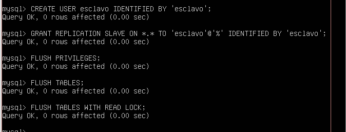
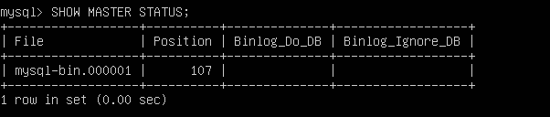
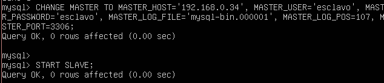
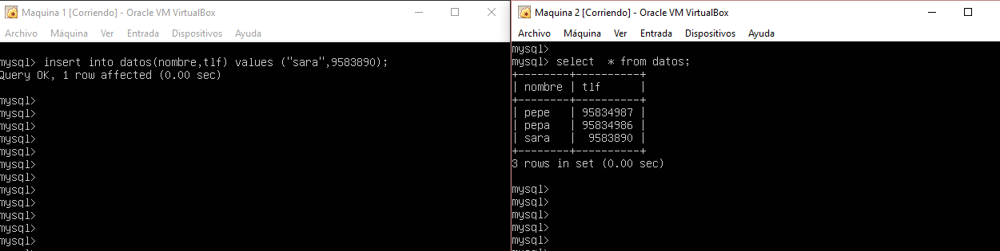

#Practica 5: Replicación de bases de datos MySQL

En esta practica vamos a realizar copias de seguridad entre dos servidores distintos de una base de datos.

##Creando una BD 

Para crear una base de daos en primer lugar debemos acceder a la interfaz de MySQL con el comando 

	mysql -uroot -p

E ingresamos la contraseña.

 

Creamos la base de datos y le añadimos una tabala con los comandos

    mysql> create database contactos;
    use contactos;
    create table datos(nombre varchar(100),tlf int);

y le añadimos filas a la tabla, quedando de la forma

 

##Realizar copia de seguridad con mysqldump

Para realizar la copia de la base de datos con mysqldump debemos bloquear el acceso a la base de datos con el comando dentro de la interfaz de mysql

	FLUSH TABLES WITH READ LOCK;

y despues salir de la interfaz ejecutamos el comando

	mysqldump contactos -u root -p > /root/contactos.sql

Y accedemos a la interfaz de mysql para desbloquear la base de datos con el comando

UNLOCK TABLES;

Con esto hemos acabado con la máquina 1. Ahora en la máquina 2 ejecutamos el comando

	scp root@ip-maquina1:/root/contactos.sql /root/

 

Ahora antes de nada, debemos acceder a la interfaz de mysql en la máquina 2, ya que como este proceso no crea automaticamente la base de datos debemos crearla a mano. Solo nos hace falta el comando:

    mysql> create database contactos;

Y por ultimo ejecutamos el comando 

	mysql -u root -p contactos < /root/contactos.sql

 

##Configuracion maestro esclavo

En primer lugar, debemos modificar la configuración de mysql en la máquina que va a tener el rol de maestro, en neustro caso la máquina 1. 

Para ello abrimos el archivo /etc/mysql/my.cnf y hacemos las siguientes modificaciones:

-Comentamos el parámetro bind-address: #bind-address 127.0.0.1
-Descomentar la linea log-bin etc
-Establecemos el identificador del servidor descomentando la linea: server-id = 1
-Guardamos y reiniciamos el servivio: /etc/init.d/mysql restart

Y ahora en la máquina 2 hacemos lo mismo, solo que cambiamos el segundo paso por server-id = 2

Por ultimo, volvemos a la máquina maestro para crear un usuario y darle permisos para la replicación:

 

 

Ahora volvemos a la máquina exclava, entramos en mjysql y le damos los datos del maestro e iniciamos el esclavo de la siguiente forma:

 

Desbloqueamos las tablas en la máquina 1 con el comando UNLOCK TABLES y añadimos una fila a la base de datos para comprobar que se realiza la copia

 

