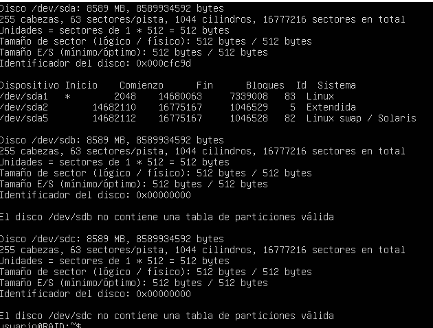
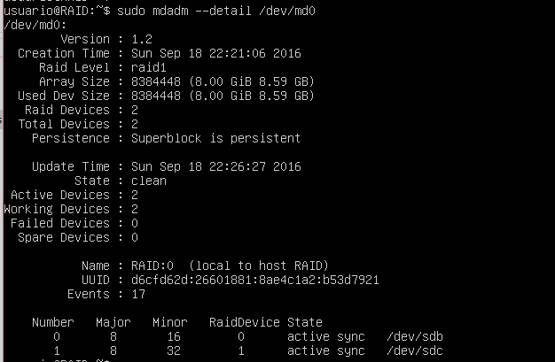
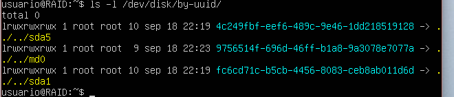
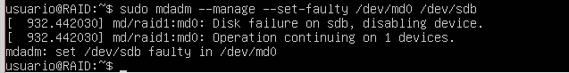
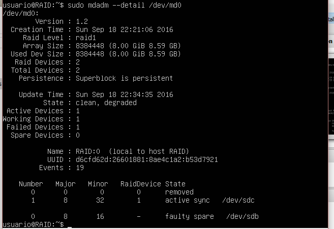
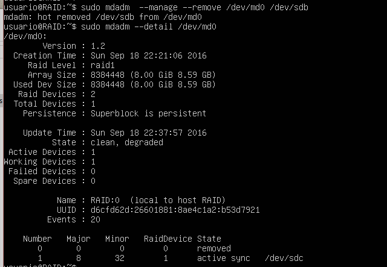
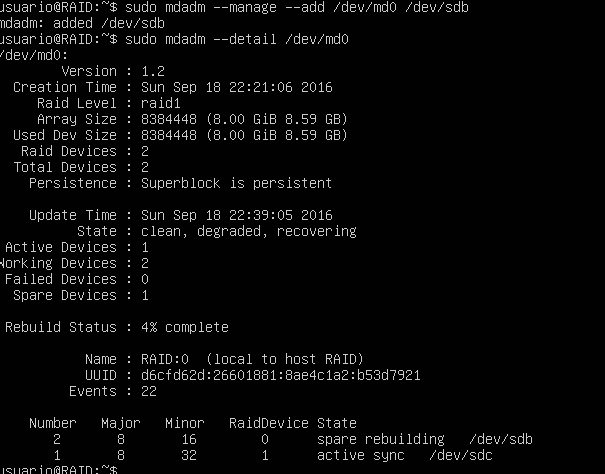

#Practica 6: Discos en RAID

El objetivo de esta práctica es configurar dos discos en RAID 1 por software, en una máquina virtual con ubuntu 12.04 server.

##Configuración de los discos en RAID 1

En este punto nuestra máquina virtual debe tener asignados otros 2 discos duros. Si no es el caso debe aadirse otro con la máquina apagada.

Instalamos el software necesario para la virtualización con el comando

sudo apt-get install mdadm

Buscamos la información de los dos discos duros.

 

Y creamos el RAID 1, utilizando el dispositivo /dev/md0 con el comando

sudo mdadm -C /dev/md0 --level=raid1 --raid-devices=2 /dev/sdb /dev/sdc

Le damos formato con el comando 

sudo mkfs /dev/md0

Y creamos el directorio en el que se montara la RAID

sudo mkdir /dat
sudo mount /dev/md0 /dat

Y comprobamos el estado de la RAID

 

Para que se monte el dispositivo de forma automatica al iniciar el sistema, buscamos la id del dispositivo de la siguiente manera

 

Y añadimos al final del archivo /etc/fstab la siguiente linea

UUID=ide /dat ext2 defaults 0 0

##Simular el fallo de uno de los dicos

Para simular el fallo de uno de los discos podemos hacerlo de la siguiente manera

 

Y comprobamos el estado de la RAID

 

Eliminamos en caliente el disco con fallo

 

Y lo añadimos finalmente 

 