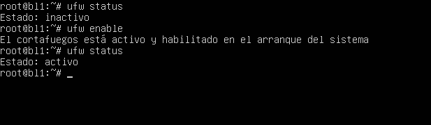
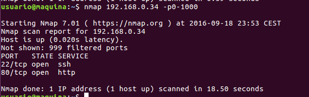
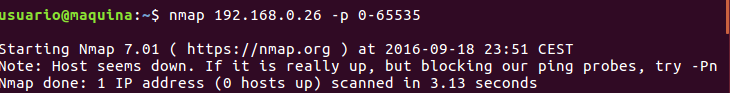
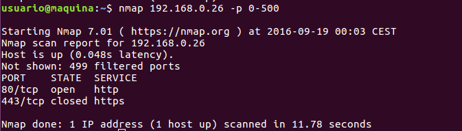
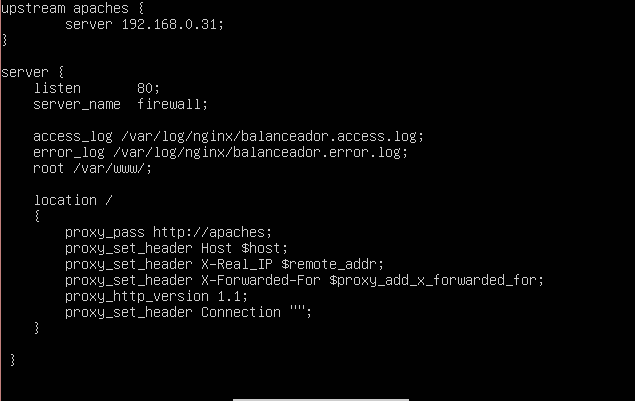
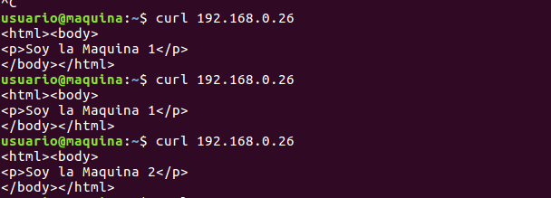

#Trabajo SWAP: Configuración del cortafuegos de la granja web

Para configurar el cortafuegos de la máquina vamos a usar el programa UFW, que viene por defecto intalado. Se reaizara sobre una máquina con nginx configurada para que redirija el trafico al balanceador de la granja web.

En primer lugar utilizamos el comando

sudo ufw status

Para comprobar si esta activo o no UFW. Si esta desactivado utilizamos el comando 

sudo ufw enable

 

Con la herramienta nmap podemos comproobar que puertos tiene abiertos una máquina. A modo de ejemplo, vamos a ejecutar nmap en una de las maquinas finales para ver que puertos tiene abiertos. En este caso solo comprobamos los 1000 (comando -p) primeros puertos tcp (opcion por defecto)

 

Y ahora a la máquina CORTAFUEGOS

 

Como vemos no tenemos ningún puerto abierto.

Para dar acceso solamente a comunicaciones http y https abrimos los puertos del cortafuegos 80 y 443 con las ordenes

sudo ufw allow 80/tcp
sudo ufw allow 443/tcp

Y escneamos, obteniendo los puertos 80 y 443

 

Configuramos gninx para que apunte al balanceador y reiniciamos el servicio

 

Ahora hacemos las peticiones a la maquina firewall y vemos como se realizan las peticiones correctamente

 